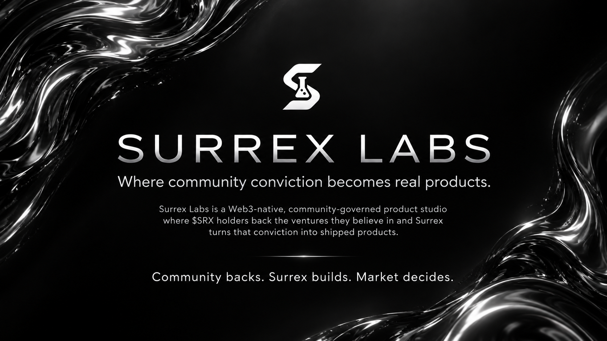

# SURREX LABS DAO

**Community backs. Surrex builds. Market decides.**

SURREX LABS is a Web3-native, community-governed product studio. Its DAO connects community ideas and $SRX holder conviction to a team responsible for research, product planning, development, testing, deployment, launch, and iteration.

The intended model is a **community-governed build market**: members propose product opportunities, holders back the ventures they believe should be built, and stronger backing moves opportunities higher in the execution queue. Surrex turns selected ventures into products; usage, retention, feedback, and revenue determine what deserves to scale.

Surrex also operates **Surrex Builder**, the self-serve product-building path described in the updated pitch deck. The existing documentation introduces the AI builder as [Surrex Vibe Studio](https://app.surrexlabs.com). This path lets founders and creators build their own products alongside the DAO's community-backed venture pipeline.


This update reflects the supplied nine-page SURREX pitch deck, "pitcdeck updated surrex .pdf": the build-market model on pages 1-5, token utility on page 6, team on page 7, allocations on page 8, and roadmap on page 9. The deck describes the intended design; it does not establish that the backing mechanism, token structure, or revenue split is deployed or approved. Final implementation details must be published through official SURREX channels and the applicable governance process.


## The operating loop

1. **Propose** - community members surface product opportunities.
2. **Back with $SRX** - holders stake behind ventures they believe deserve execution.
3. **Greenlight** - stronger conviction moves ventures higher in the execution queue, subject to the final selection rules.
4. **Build** - Surrex researches, scopes, designs, develops, tests, and deploys.
5. **Launch** - products reach real users.
6. **Measure** - usage, retention, feedback, and revenue guide further work.
7. **Repeat** - successful products strengthen the ecosystem and support future builds.

## Why a DAO needs a delivery team

Communities can coordinate ideas, capital, attention, governance, and distribution. The harder step is turning a decision into a maintained product. SURREX connects that community direction to a small core team, an AI execution system, and an expandable specialist network.

The DAO helps determine what deserves execution. Surrex owns delivery and reporting. Market evidence informs whether to improve, expand, or revisit a venture. Read [the DAO thesis](dao-thesis.md) and [the team and execution system](team.md) for the full model.

## How value returns to the ecosystem

The deck proposes allocating venture revenue across four destinations:

| Destination | Proposed share |
| --- | --- |
| Venture backers | 50% |
| $SRX buybacks | 25% |
| Surrex treasury | 24% |
| Idea originator | 1% |

These percentages are proposed and tunable as the DAO and its legal and economic structure mature. Venture backing and simply holding $SRX are different forms of participation; holding the token alone does not establish a right to the backer allocation. The revenue basis, eligibility, and payout mechanics still need definition. See [Treasury & value flow](treasury-and-value.md).

## Read next

- [The DAO thesis](dao-thesis.md)
- [How SURREX works](how-it-works.md)
- [Join the DAO](getting-started.md)
- [The $SRX token](token.md)
- [Roadmap](roadmap.md)

This documentation explains the intended system. It is not financial, legal, tax, or investment advice.
