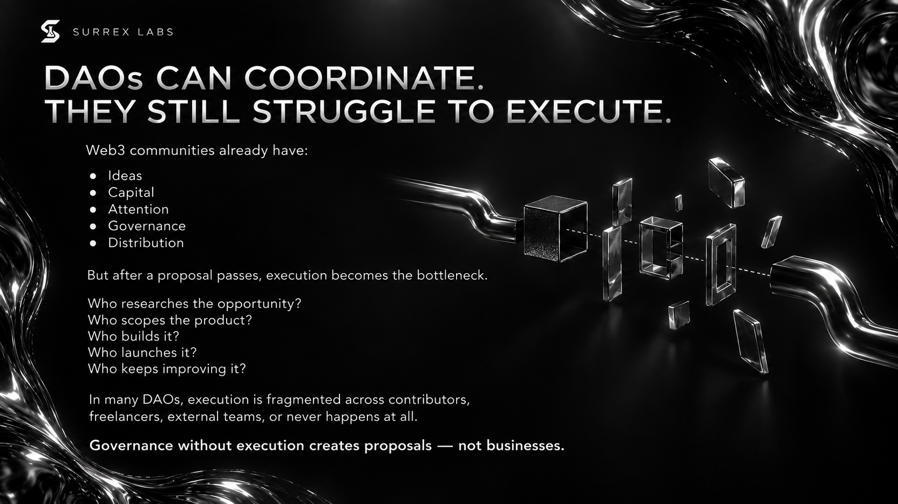
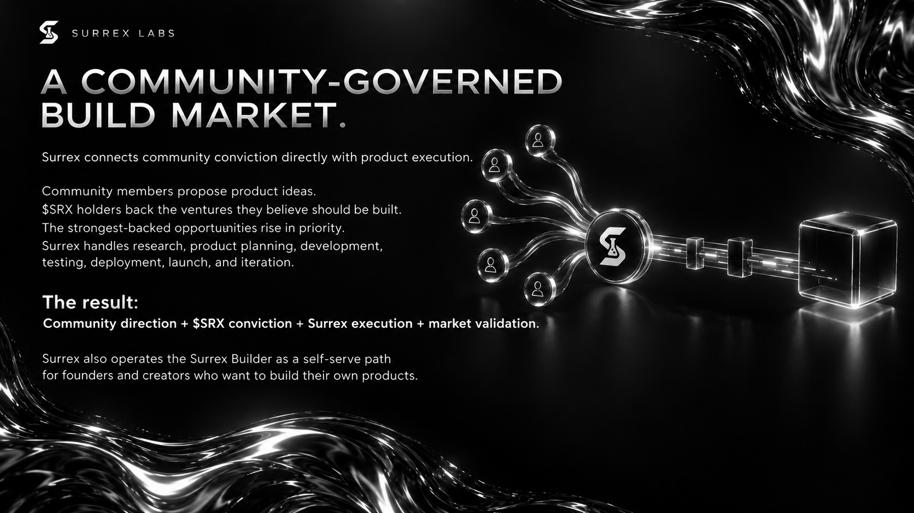

# The DAO thesis

SURREX is built around one belief: **collective decisions become more valuable when a capable team is accountable for turning them into products.**

## The coordination gap

Crypto communities are good at discovering ideas, forming conviction, and mobilizing contributors. The difficult part comes after a vote: product definition, design, engineering, security, launch, distribution, maintenance, and iteration.

SURREX closes that gap with a permanent product studio. The DAO sets direction; Surrex Labs turns selected priorities into product work with milestones the community can inspect.

## A community-governed build market

*The pitch deck's intended build-market model.*

The updated pitch deck makes product selection explicit: members propose opportunities, $SRX holders back ventures, and stronger conviction moves those ventures higher in the execution queue. Surrex supplies the research, planning, development, testing, deployment, launch, and iteration needed to turn a selected opportunity into a product.

This connects four parts of the model: **community direction + $SRX conviction + Surrex execution + market validation**. Community support establishes what deserves attention; usage, retention, feedback, and revenue establish what deserves to scale.

AI can lower the effort required to build software, but product selection, distribution, maintenance, and user demand still determine whether a venture succeeds. The DAO contributes ideas and coordination throughout that process.

## What makes it a product DAO

A product DAO is not a grant directory, an agency with a token, or a passive investment club. Its core output is a portfolio of products selected through governance and delivered through a repeatable operating system.

SURREX combines four systems:

- **Governance** for proposals, deliberation, voting, and accountability.
- **Treasury coordination** for allocating resources against approved mandates.
- **Product delivery** covering research, product strategy, design, engineering, security, launch, and growth.
- **Ecosystem economics** designed so successful products can replenish the treasury, support future builds, and fund approved rewards for the people who help create value.

The deck proposes a venture revenue split of 50% to venture backers, 25% to $SRX buybacks, 24% to the Surrex treasury, and 1% to the idea originator. These are proposed allocations, with eligibility and implementation still to be defined. Participation does not guarantee revenue or profit. See [Treasury & value flow](treasury-and-value.md).

## Design principles

### Votes with consequence

A passing proposal should create a clear mandate, owner, scope, budget envelope, and reporting cadence.

### Build in public

Approved work should expose milestones, decisions, blockers, and learning without compromising security or private user data.

### Outcomes over activity

Shipping is not the finish line. Products should be evaluated against adoption, usefulness, sustainability, and ecosystem value.

### Progressive decentralization

Control should move toward the community as the governance system, treasury safeguards, and contributor network mature.

**Next:** [How SURREX works](how-it-works.md)
