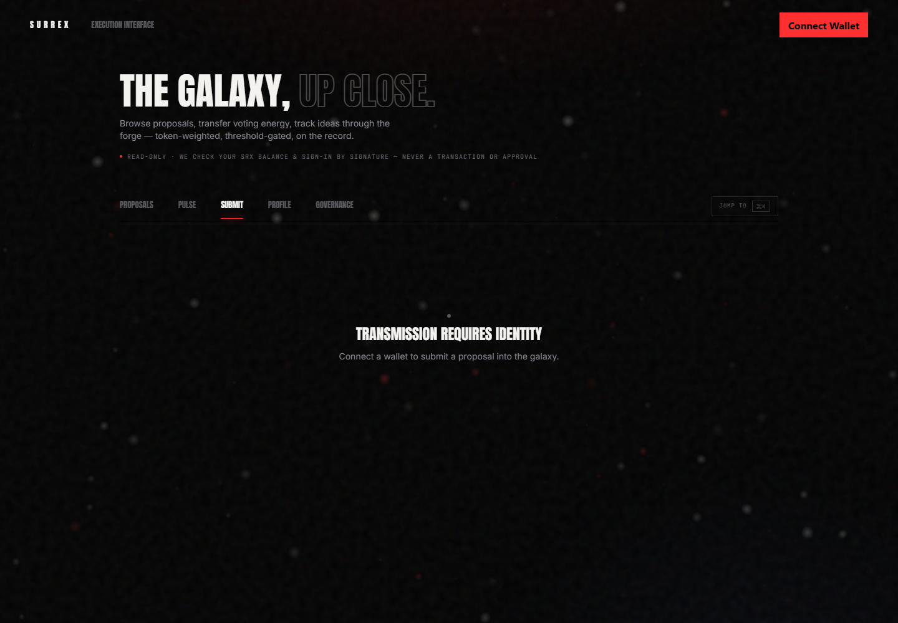
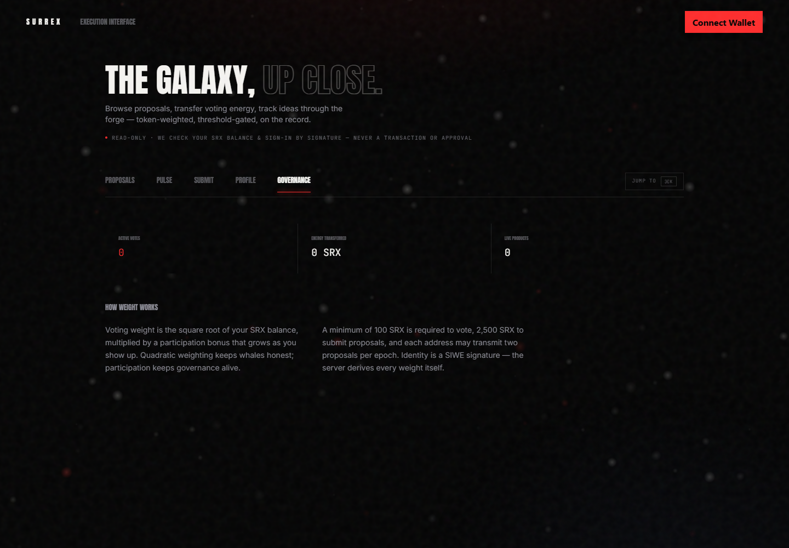

# How SURREX works

SURREX connects community direction, $SRX backing, studio execution, and market validation in one product-building loop. The updated pitch deck describes the following intended workflow.

## 1. Propose

Community members identify a product opportunity and submit a structured brief: the problem, intended users, proposed solution, strategic fit, risks, resources, and success criteria. Discussion helps improve the idea before it enters the venture pipeline.

This repository screenshot illustrates the proposal entry point. Submission eligibility and wallet interactions depend on the current implementation.

## 2. Back with $SRX

The proposed model lets holders stake $SRX behind ventures they believe should be built. Backing expresses conviction in a specific opportunity and helps establish its priority. The deck also describes flexible backing: holders can move support between ventures as conviction changes.

Minimum backing, custody, lock periods, withdrawal rules, and reallocation timing are not specified in the deck. Flexible backing should not be interpreted as a promise of instant withdrawals or unrestricted transfers.

## 3. Greenlight

Higher conviction moves a venture higher in the execution queue. The final selection process must explain how backing is measured, how capacity is considered, and who authorizes a venture to enter delivery. The deck does not specify a numerical greenlight threshold or an automatic launch trigger.

Governance decisions establish any required budget and mandate. Venture backing supplies a product-priority signal; the relationship between that signal and formal votes must be defined in the approved rules.

This existing governance screenshot is interface context, not evidence that the proposed $SRX backing system is live. Refer to approved governance records and the official interface for active rules.

## 4. Build

Surrex turns a selected venture into a delivery plan covering research, scope, design, development, testing, and deployment. An accountable owner reports milestones, blockers, and material scope or budget changes. See [The product delivery layer](execution.md).

## 5. Launch

Products ship publicly to real users with onboarding, support, and a way to collect feedback. Launch makes the venture's assumptions testable in the market.

## 6. Measure

Usage, retention, feedback, and revenue determine what deserves to scale. Public reporting should connect results to the original proposal so the community can evaluate progress and further resource requests.

## 7. Repeat

Successful execution can add revenue, reusable technology, distribution, and operating knowledge to the ecosystem. The [proposed venture revenue model](treasury-and-value.md) connects that value to backers, buybacks, the treasury, and idea originators. The next cycle uses both resources and learning from earlier ventures.

| Participant or layer | Primary role |
| --- | --- |
| Community | Surface opportunities, improve briefs, test, and distribute products |
| $SRX backers | Express venture-specific conviction and influence build priority |
| Governance participants | Decide matters covered by the approved governance framework |
| Surrex team and execution system | Research, build, launch, maintain, and report |
| Treasury | Support approved ecosystem work under published controls |
| Product users | Provide usage, retention, feedback, and revenue evidence |

**Next:** [Join the DAO](getting-started.md)
