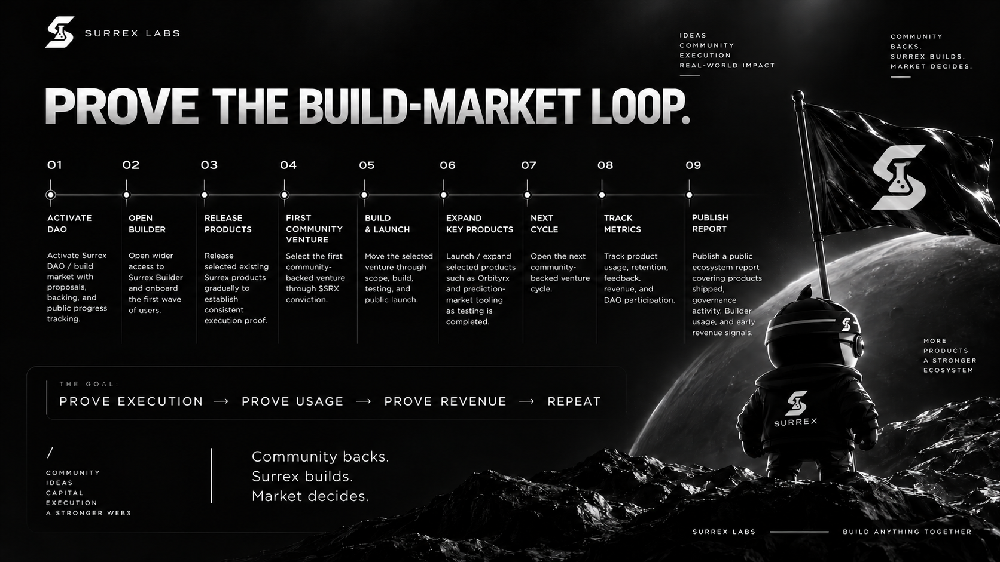

# Roadmap

The updated pitch deck organizes the roadmap around proving the build-market loop: **prove execution -> prove usage -> prove revenue -> repeat**.

The milestones below describe the intended sequence. The deck does not provide completion dates or establish which milestones are already complete.

*The pitch deck's planned sequence. The table below provides the same milestones in readable text. [View the full-size slide](assets/pitch-deck/build-market-roadmap.png).*

| Step | Milestone | Intended outcome |
| --- | --- | --- |
| 1 | Activate DAO | Activate the DAO / build market with proposals, backing, and public progress tracking |
| 2 | Open Builder | Open wider access to Surrex Builder and onboard the first wave of users |
| 3 | Release products | Gradually release selected existing Surrex products to establish consistent execution proof |
| 4 | First community venture | Select the first community-backed venture through $SRX conviction |
| 5 | Build and launch | Move the selected venture through scope, build, testing, and public launch |
| 6 | Expand key products | Launch or expand selected products such as Orbitryx and prediction-market tooling as testing is completed |
| 7 | Next cycle | Open the next community-backed venture cycle |
| 8 | Track metrics | Track product usage, retention, feedback, revenue, and DAO participation |
| 9 | Publish report | Publish an ecosystem report covering products shipped, governance activity, Builder usage, and early revenue signals |

## How progress should be judged

Progress should be visible through selected proposals, delivery milestones, public launches, and evidence of real product use. Revenue reporting should distinguish observed revenue from forecasts and any implemented allocations from the [proposed revenue model](treasury-and-value.md).

Public ecosystem reports should let participants connect the original backing decision to what shipped, how users responded, and what the team learned before opening the next venture cycle.


This is a sequence of planned outcomes, not a dated launch commitment. Governance decisions, implementation readiness, product testing, and market feedback can change the order or scope.


**Next:** [Risks and disclosures](risks.md)
