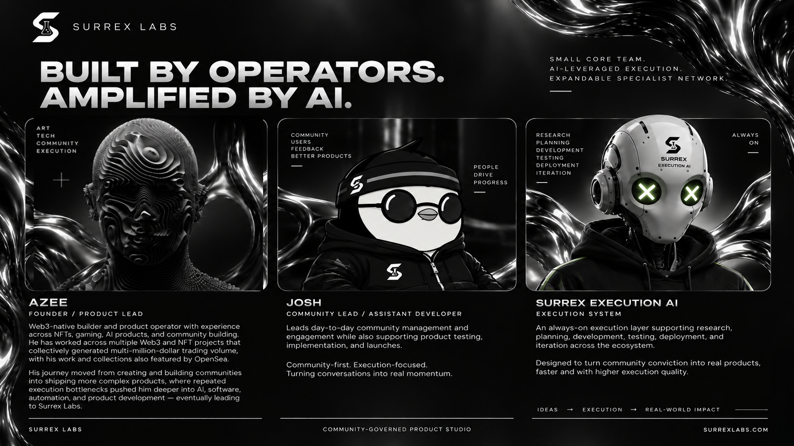

# Team & execution system

The updated pitch deck presents SURREX as a small core team supported by AI execution and an expandable specialist network. The following roles reflect the deck's team slide.

*Team artwork and roles from the pitch deck. [View the full-size slide](assets/pitch-deck/team-and-execution-ai.png).*

## Azee - Founder / Product Lead

Azee leads product direction. The deck describes experience across NFTs, gaming, AI products, and community building, with a progression from art and communities into software, automation, and product development. Within the SURREX model, this role connects community opportunities to practical product scope and execution.

## Josh - Community Lead / Assistant Developer

Josh leads day-to-day community management and engagement while supporting product testing, implementation, and launches. The role helps turn community feedback and participation into delivery input.

## Surrex Execution AI - Execution system

Surrex Execution AI is the supporting execution system described in the deck. It assists research, planning, development, testing, deployment, and iteration across the ecosystem.

The human delivery team remains accountable for approved work, review, and release decisions. Authority over budgets, governance, and treasury actions must remain defined by the applicable rules.

## Working with the DAO

The community surfaces and evaluates opportunities, $SRX backing helps determine venture priority, and the delivery team moves selected work through build and launch. Progress and product results return to the DAO through public reporting. Specialist contributors can extend the team's capability as the work requires.

**Next:** [Roadmap](roadmap.md)
