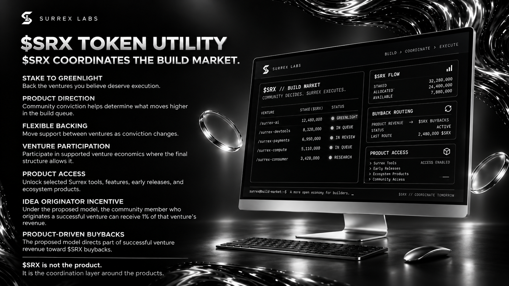
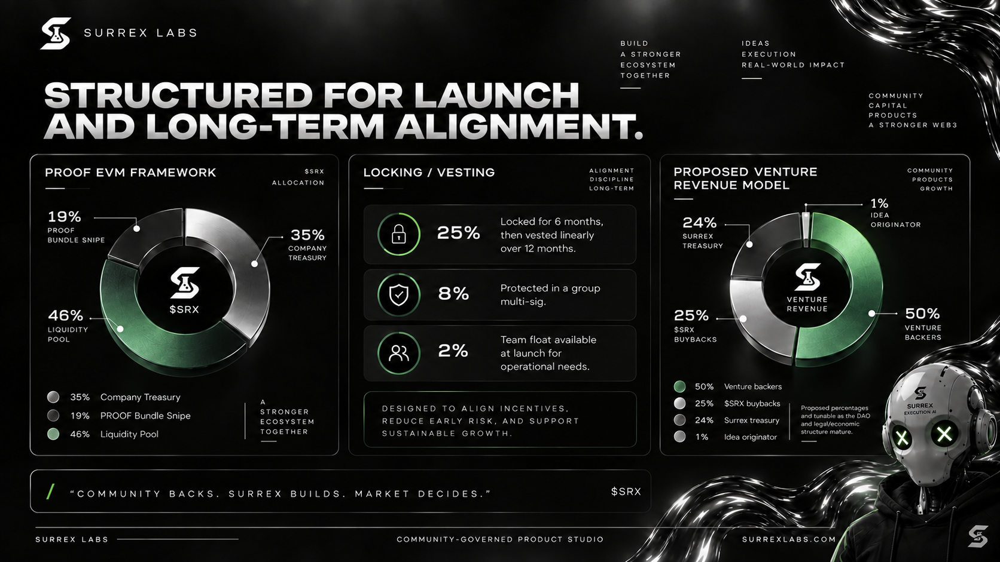

# The $SRX token

The updated pitch deck identifies **$SRX** as the coordination token for SURREX's community-governed build market. Its intended utility connects venture selection, ecosystem participation, and selected product access.

## Intended utility

*Pitch deck illustration of proposed utility. The dashboard artwork does not verify live balances, product access, or active buybacks. [View the full-size slide](assets/pitch-deck/srx-token-utility.png).*

| Utility | Proposed role |
| --- | --- |
| Stake to greenlight | Back ventures that holders believe deserve execution |
| Product direction | Use community conviction to influence priority in the build queue |
| Flexible backing | Move support between ventures as conviction changes, subject to final rules |
| Venture participation | Participate in supported venture economics where the final structure allows it |
| Product access | Unlock selected Surrex tools, features, early releases, and ecosystem products |
| Idea-originator incentive | Allocate a proposed 1% of a successful venture's revenue to its community idea originator |
| Product-driven buybacks | Route a proposed portion of venture revenue toward $SRX buybacks |

The [venture revenue proposal](treasury-and-value.md) allocates 25% to buybacks. Neither backing nor token ownership establishes an automatic payout, guaranteed product access, or return before the relevant terms are implemented.

## Deck allocation: PROOF EVM framework

*Launch design and proposed economics from the pitch deck. [View the full-size slide](assets/pitch-deck/token-allocation-and-revenue.png).*

The launch framework shown in the deck allocates $SRX as follows. This is the documented design, not confirmation of a completed distribution.

| Allocation | Share |
| --- | --- |
| Company treasury | 35% |
| PROOF Bundle Snipe | 19% |
| Liquidity pool | 46% |
| **Total** | **100%** |

"PROOF EVM framework" and "PROOF Bundle Snipe" are the deck's labels. The deck does not define the bundle mechanism, its recipients, or a specific blockchain deployment. Those details require separate launch documentation.

## Locking and vesting design

The deck lists the following percentages alongside the allocation:

| Portion shown | Treatment in the deck |
| --- | --- |
| 25% | Locked for 6 months, then vested linearly over 12 months |
| 8% | Protected in a group multisignature wallet |
| 2% | Team float available at launch for operational needs |

These portions total 35%, matching the company treasury allocation. The slide does not explicitly label their allocation relationship; final token documents should confirm it, together with the schedule's start event, custody addresses, signer policy, and release mechanics. Multisignature protection is a custody control, not a stated vesting period.

## Details still to be published

- Specific blockchain network, token standard, and verified contract address.
- Total supply, initial circulating supply, and recipient addresses.
- Launch date, liquidity venue, and implementation of the PROOF framework.
- Backing contracts, minimum amounts, lock and withdrawal rules, and reallocation mechanics.
- Conviction calculation, greenlight criteria, and the relationship to voting and delegation.
- Venture eligibility, revenue accounting, distribution timing, and buyback execution rules.
- The scope and conditions of product access.

The token allocation and venture revenue allocation describe different things: the former distributes tokens, while the latter proposes how venture revenue would be used.


The deck establishes design intent. It does not provide a verified token contract, deployed staking mechanism, or completed security review. Final terms and approved governance records must establish the active rules.


## Token-holder responsibilities

Governance participants should verify transactions, protect wallet credentials, assess proposal conflicts, and understand the active backing and governance rules. Possessing $SRX does not guarantee profit, governance outcomes, or rights beyond the final governing terms.

**Next:** [Products and ecosystem](ecosystem.md)
